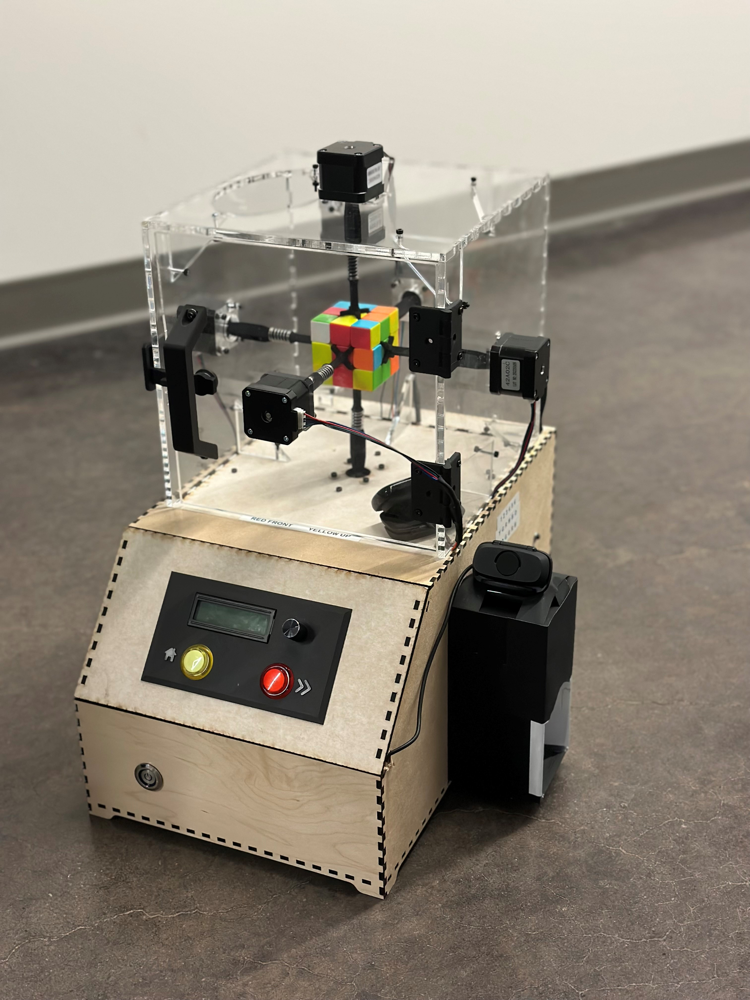

# Rubik's Cube Solver
System to automatically solve a Speed cube from any state

The system requirements were:
- Use Computer Vison to capture the current state of the cube
- Develop a non-trivial solving algorithm
- Use motors to actuate the faces of the cube to solve it

# Key Features
- Computer Vision to Automatically Detect Current State
- CFOP Algorithm
- Simple User Interface (Auto-solve, Step-solve, Shuffle)
- Display each Move in Sequence
- Cube is Removable

# Demo
Video link coming soon

# Contributers
Peri Hassanzadeh, Alex Haver, Matt Meehan, Prosper Tjelmeland 